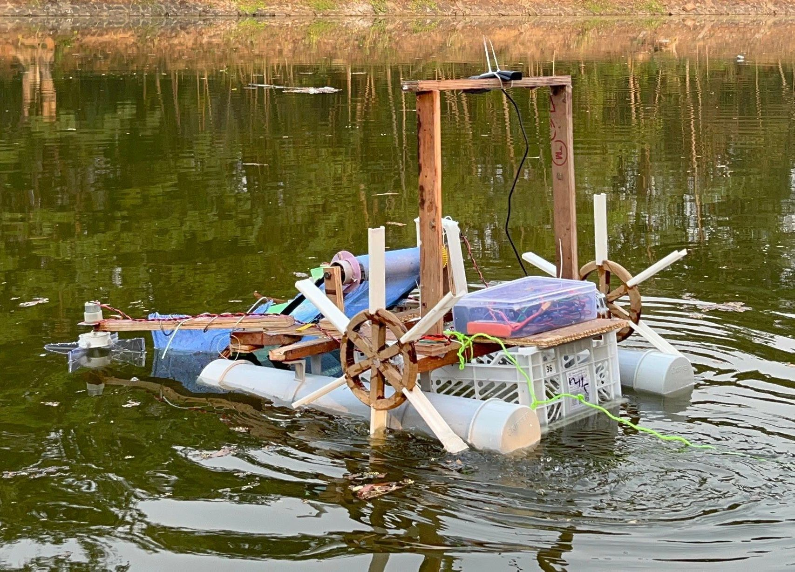

## Aquatic Robot for trash cleaning on still water
This repository contains the design files of an autonomous aquatic robot powered by YOLO based vision model. The control algorithm involves cascaded PID implementation in python with GPIO pins controlled by GPIO Zero library. 

This design contains all models that were successfully deployed on a working model. The details can be found in `"./Hardware Modelling Report final.pdf"` 

## Segments of design
- `./cv_model` : contains computer vision model details that trash detection signals to control algorithm
- `./mechanical_model` : contains CAD and harware details of the robot
